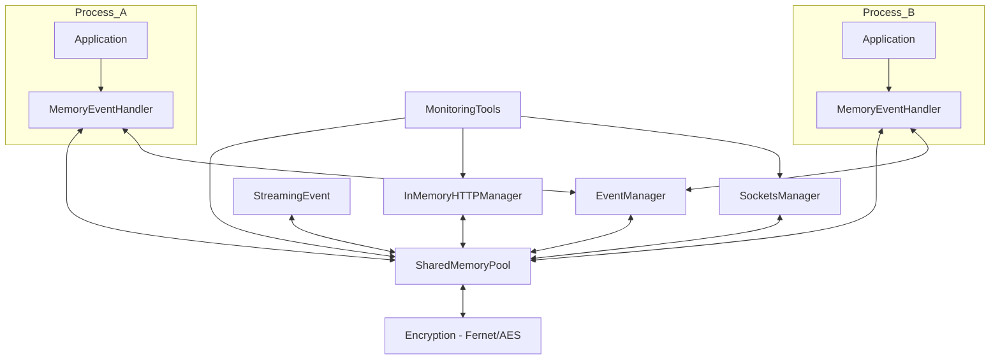
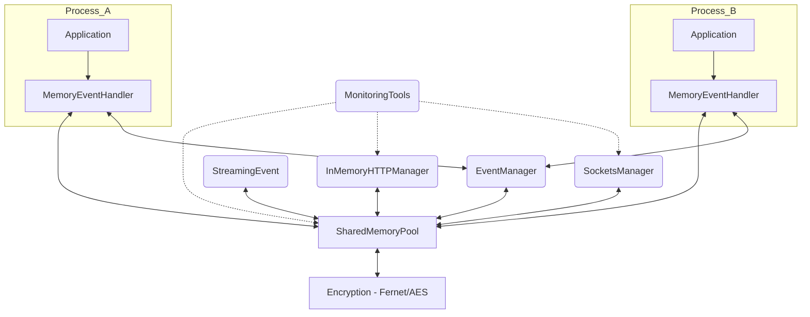
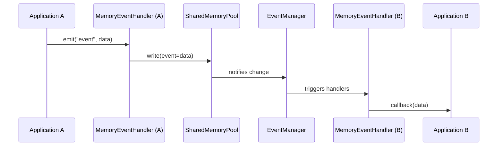

# mvent Engineer's Documentation

## Table of Contents

1. [Introduction](#introduction)
2. [Core Design & Architecture](#core-design--architecture)
   - [SharedMemoryPool](#sharedmemorypool)
   - [EventManager](#eventmanager)
   - [MemoryEventHandler](#memoryeventhandler)
3. [Advanced Modules](#advanced-modules)
   - [InMemoryHTTPManager](#inmemoryhttpmanager)
   - [StreamingEvent](#streamingevent)
   - [SocketsManager](#socketsmanager)
   - [MonitoringTools](#monitoringtools)
   - [Encryption](#encryption)
4. [Public API Reference](#public-api-reference)
5. [Usage Patterns & Workflows](#usage-patterns--workflows)
6. [Benchmarking](#benchmarking)
7. [Subsystem and Data/Event Flow Diagrams](#subsystem-and-dataevent-flow-diagrams)
8. [Engineering Notes & Edge Cases](#engineering-notes--edge-cases)
9. [Installation, Migration & Compatibility](#installation-migration--compatibility)
10. [Contribution and Support](#contribution-and-support)

---

## Introduction

**mvent** is a modern Python package for event-driven **shared memory** communication and ultra-fast, safe, in-memory IPC. It’s designed for devs who want to build distributed, multi-process (or even multiprocessor!) systems that need to thrill on low-latency data exchange, with real monitoring, encryption, and the power/finesse of event-driven programming.

#### Why you'd use mvent:
- Sick of bottlenecks and boilerplate in multi-process apps?
- Hate server/firewall/config hell for local IPC?
- Need rock-solid thread/process safety, built-in monitoring, and optional AES-grade encryption?
- Want pure Python, but with speed closer to C-backed IPC than the sad “standard” libs?

You're welcome.

**Key features, bro:**
- Atomic, event-driven shared memory comms
- Decorator-based API for minimal cognitive load
- TTL for ephemeral data
- In-memory "HTTP", streaming data, and socket-style channels
- Drop-in monitoring/statistics
- Pluggable encryption (Fernet/AES)
- Zero-hassle resource management, cleanup, and thread/process safety

---

## Core Design & Architecture

Here’s where we get into the *meat* of mvent. At its heart:

- **SharedMemoryPool:** The literal “pool” of data, mapped in RAM and accessible (safely!) across Python processes. Think pickleable objects, TTL, instant publish/subscribe, and optional encryption.
- **MemoryEventHandler:** The event-to-handler glue—lets you `@on("event")` and broadcast updates across processes.
- **EventManager:** Watches pools for changes and dispatches notifications with gnarly efficiency.

> **Architecture Block Diagram**



---

### SharedMemoryPool

This is the RAM-powered backbone of mvent. Supports:
- **Data lifecycle:** Create/attach, store Python objects (pickled), auto-TTL, explicit cleanup
- **Thread/process safety:** Platform-agnostic file locks, atomic updates
- **Encryption:** Opt-in per-pool, Fernet/AES block encryption (on pickle blobs), transparent on read/write
- **Scalability:** Memory limited only by OS/disk quota; multiplex any number of handlers/processes
- **Extensibility:** Swap mmap for distributed stores if you hate the OS

### EventManager

- **Event registrations** are indexed/listed per pool
- **Change detection:** Watches pool values for each event-name key
- **Callback dispatch:** Emits to all registered (live) handlers, any process on that pool
- **Threaded watchers:** Decouples event emission from heavy handler logic; handlers never block system

### MemoryEventHandler

- **Decorator API:** `@on(event_name)` for dead-simple registration
- **Emit, cleanup, multi-handler:** Trigger events for shared-state data, manage lifecycle programmatically or via context
- **Full process-awareness:** Handlers like broadcast—other processes running will get the ping (if not deadlocked, obviously)

---

## Advanced Modules

Time for the **gourmet** stuff, dude.

### InMemoryHTTPManager

- **HTTP gone RAM:** Route `"/myendpoint"` to handler, but traffic never hits the wire. Insanely fast, with full request/response objects.
- **Streaming:** Route returns `StreamingEvent` if handler wants to chunk or "flush" multi-part data (think: video, logs, blobs)
- **Use-cases:** Local "APIs," perf benchmarking, fake microservices, serverless shims, etc.

### StreamingEvent

- **Observable pattern**: zero-overhead, multi-subscriber, channel-based data feeds (over shared memory!)
- **Backpressure awareness:** Monitors slow subscribers, tracks delivery stats
- **Atomic pub/sub:** All subscribers, all processes on the pool, guaranteed order

### SocketsManager

- **Room/channel messaging:** Sane pub/sub, multi-producer and multi-consumer
- **All in memory:** No kernel-level sockets, no TCP/UDP, just fast AF data moves
- **Integrates with monitors/encryption**

### MonitoringTools

- **Perf stats:** Auto track handler call times, event frequency, memory use per pool
- **Realtime:** Expose these via in-RAM HTTP or custom endpoints
- **Wrap any function** to get granular timing and exception stats

### Encryption

- **Per-pool opt-in:** AES/Fernet, drop-in with Python’s cryptography lib
- **Zero friction:** Read or write as usual—encryption happens below the API, no code changes if you go from plaintext to encrypted pools

---

## Public API Reference

### MemoryEventHandler

```python
from mvent.decorators.memory_events import MemoryEventHandler
memory_events = MemoryEventHandler(pool_name: str)
@memory_events.on(event_name: str)
def callback(new_value):
    ...
memory_events.emit(event_name: str, value: object, ttl: float = None)
memory_events.cleanup()
```

### SharedMemoryPool

```python
from mvent.core.shared_memory import SharedMemoryPool
SharedMemoryPool(pool_name: str, size: int = ..., encryption_key: bytes = None)
pool.set(key: str, value: object, ttl: float = None)
pool.get(key: str)
pool.delete(key: str)
pool.cleanup()
```

### InMemoryHTTPManager

```python
from mvent.core.in_memory_http import InMemoryHTTPManager
http = InMemoryHTTPManager(pool_name: str = None)
@http.route("/endpoint")
def handler(request): ...
response = http.send_request(path, method="POST", data={...}, stream=False)
```

### StreamingEvent

```python
from mvent.core.streaming_event import StreamingEvent
stream = StreamingEvent(stream_key: str)
stream.subscribe(callback)
stream.publish(data)
stream.stop()
```

### SocketsManager

```python
from mvent.core.sockets_manager import SocketsManager
sockets = SocketsManager(pool_name: str = None)
sockets.connect(room)
sockets.subscribe(room, handler)
sockets.send(room, data)
sockets.disconnect(room)
```

### MonitoringTools

```python
from mvent.core.monitoring import MonitoringTools
monitor = MonitoringTools(pool)
monitor.wrap_handler(name, fn)
monitor.record_event(name)
monitor.get_event_stats()
monitor.get_handler_stats()
monitor.get_memory_stats()
```

---

## Usage Patterns & Workflows

### Basic Event Multi-Handler

```python
memory_events = MemoryEventHandler("example_pool")
@memory_events.on("user_data")
def handle_user_update(val): print(f"Update: {val}")
@memory_events.on("user_data")
def audit(val): print(f"Audit: {val}")
memory_events.emit("user_data", {"user": "bob"}, ttl=2.0)
```

**Note:** All handlers, all processes on this pool get triggered. TTL = 2s = msg is autodeleted.

### In-Memory HTTP with Streaming

```python
http = InMemoryHTTPManager()
@http.route("/greet")
def greet_handler(request):
    return {"msg": f"Hi, {request['data']['who']}!"}
resp = http.send_request("/greet", method="POST", data={"who": "Alice"})

@http.route("/stream")
def stream_handler(req, stream_event=None):
    for chunk in range(5): stream_event.publish(f"Chunk-{chunk}")
    return stream_event
my_stream = http.send_request("/stream", stream=True)
my_stream.subscribe(lambda x: print("Got:", x))
```

---

## Benchmarking

### HTTP Benchmark

Tests **req/s, avg/p95 latency, CPU/MEM stats** between:
- mvent in-memory HTTP
- FastAPI
- http.server+requests

See [`benchmarking/benchmark_http_vs_mvent.py`](benchmarking/benchmark_http_vs_mvent.py)

### Sockets Benchmark

Tests **raw throughput, pub/sub message integrity**, for:
- mvent SocketsManager
- Normal Python TCP sockets

See [`benchmarking/benchmark_sockets_vs_mvent.py`](benchmarking/benchmark_sockets_vs_mvent.py)

> **Tip:** Use efficiency score (req/s per CPU%) for real performance comparisons. Run on "quiet" boxes only!

---

## Subsystem and Data/Event Flow Diagrams

### General Block Diagram



### Data/Event Sequence (Process A emits event for Process B)



---

## Engineering Notes & Edge Cases

### TTL Consistency

- TTL cleanup in a thread; possible sub-second retention of expired keys.

### Multiprocess Deliveries

- Events go to *all* processes on a pool—but a totally busy or deadlocked process can miss execution.

### Encryption Overhead

- Minimal, but measurable—use only for sensitive pools.

### Streaming backpressure

- Slow subs can build up chunk queues—monitor with MonitoringTools and scale out if needed.

### Debugging

- Hook `MonitoringTools` everywhere for per-pool, per-event, per-handler stats.

### Extending

- Base all new IPC patterns on `SharedMemoryPool` or `EventManager`
- Custom storage? Just update the pool layer (ditch mmap for custom, e.g. Redis, S3, whatever)

### OS caveats

- **Windows:** Data in local user's temp dir, cleaned at reboot.
- **Linux/macOS:** Uses `/tmp`; double-check permissions in shared envs.

---

## Installation, Migration & Compatibility

### Installation

```bash
pip install mvent
```
To include encryption support:
```bash
pip install cryptography
```

### Migration

- All new modules are opt-in. Legacy APIs will *just work*.
- For encryption, pass a Fernet key at pool creation:

```python
from mvent.core.shared_memory import SharedMemoryPool
from cryptography.fernet import Fernet
key = Fernet.generate_key()
secure_pool = SharedMemoryPool("secure_pool", encryption_key=key)
```

### Compatibility

- **Python:** 3.8+
- **Platforms:** Linux, Mac, Windows
- **Thread safety:** All core APIs locked & atomic; no race leaks
- **Resource:** Pools limited only by disk/quota/TTL

---

## Contribution and Support

- File issues, pull requests on [GitHub](https://github.com/cognition-brahmai/mvent)
- Docs, code, and PRs must always have full typehints and usage examples (no excuses)
- Authors: Made with <3 by [BRAHMAI](https://brahmai.in)
